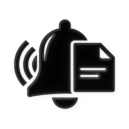
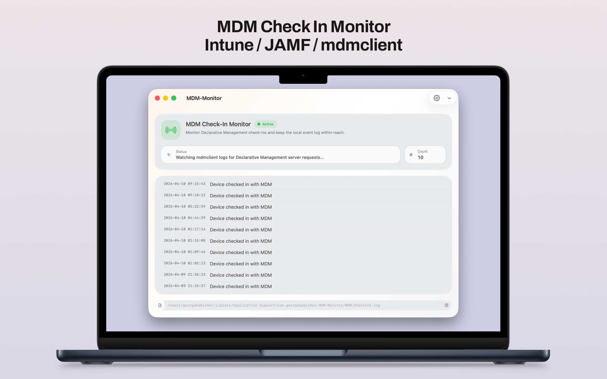
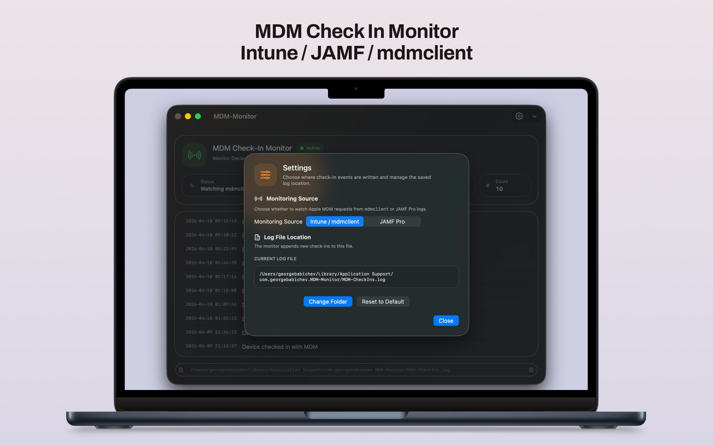

# MDM Monitor

<p align="center">
  
</p>

`MDM Monitor` is a small macOS app for watching local management check-ins in real time and writing a simple normalized event log.

It supports two monitoring modes:

- `Intune / mdmclient`
- `JAMF Pro`

In both modes, the app reduces noisy raw log lines down to a single readable event in the UI and in the app log file.

<p align="center">
  
</p>

## What The App Does

The app:

- starts a live reader for the selected monitoring source
- watches for a specific log pattern that represents a meaningful check-in
- adds a normalized event to the UI
- appends that normalized event to the app log file
- lets you start, stop, restart, clear, and reveal the app log from the toolbar

The app log is stored in Application Support under the app bundle identifier and defaults to:

`~/Library/Application Support/com.georgebabichev.MDM-Monitor/MDM-CheckIns.log`

## Monitoring Modes

### 1. Intune / mdmclient

This mode reads the macOS unified log by launching:

```bash
/usr/bin/log stream --style compact --info --predicate 'process == "mdmclient"'
```

The app records an event when mdmclient logs contain:

```text
Processing server request:
```

Notes:

- this is intended for Apple MDM activity visible through `mdmclient`
- the app currently applies a 120-second cooldown in this mode to suppress duplicate events that happen too close together

### 2. JAMF Pro

This mode tails:

```bash
/var/log/jamf.log
```

The app records an event only when a line:

- contains ` jamf[`
- contains `Checking for policies triggered by "recurring check-in"`

Example raw JAMF line:

```text
Fri Apr 10 04:38:51 TestUser's Virtual Machine jamf[13474]: Checking for policies triggered by "recurring check-in" for user "testuser"...
```

When that happens, the app writes a normalized event like:

```text
2026-04-10 10:15:00 Device checked in with JAMF Pro
```

Notes:

- the app intentionally ignores the surrounding JAMF noise such as:
  - `Removing existing launchd task ...`
  - `Checking for patches...`
  - `No patch policies were found.`
- this keeps one JAMF recurring check-in cycle mapped to one event in the UI

## Exact Checks

The current app logic is:

- `Intune / mdmclient` mode:
  - source: unified log
  - process filter: `mdmclient`
  - match text: `Processing server request:`
- `JAMF Pro` mode:
  - source: `/var/log/jamf.log`
  - match text: `Checking for policies triggered by "recurring check-in"`
  - additional guard: line must also contain ` jamf[`

## Bash Equivalents

### mdmclient Mode

File: [`MDM_CheckIn_Monitor.sh`](/Users/georgebabichev/Developer/Apps-Code/MDM-Monitor/MDM_CheckIn_Monitor.sh)

```bash
#!/bin/bash

echo "Waiting for mdmclient check-ins..."

/usr/bin/log stream --info --predicate 'process == "mdmclient"' | \
while IFS= read -r line; do
    [[ "$line" == *"Processing server request:"* ]] || continue
    echo "$(date '+%Y-%m-%d %H:%M:%S') Device checked in with MDM"
done
```

### JAMF Pro Mode

File: [`JAMF_CheckIn_Monitor.sh`](/Users/georgebabichev/Developer/Apps-Code/MDM-Monitor/JAMF_CheckIn_Monitor.sh)

```bash
#!/bin/bash

echo "Waiting for JAMF Pro recurring check-ins..."

/usr/bin/tail -n 0 -F /var/log/jamf.log | \
while IFS= read -r line; do
    [[ "$line" == *' jamf['* ]] || continue
    [[ "$line" == *'Checking for policies triggered by "recurring check-in"'* ]] || continue
    echo "$(date '+%Y-%m-%d %H:%M:%S') Device checked in with JAMF Pro"
done
```

## Permissions / Caveats

- `mdmclient` mode depends on access to the unified log
- `JAMF Pro` mode depends on read access to `/var/log/jamf.log`
- if either source is not readable in the current execution context, the app will surface an error in the UI
- the app normalizes events for readability; it is not intended to preserve every raw management-framework log line

## 📝 Changelog

### 1.0.0
- Initial Release.
